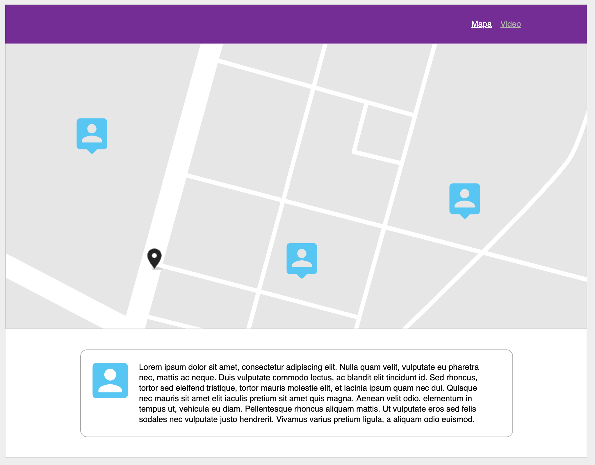
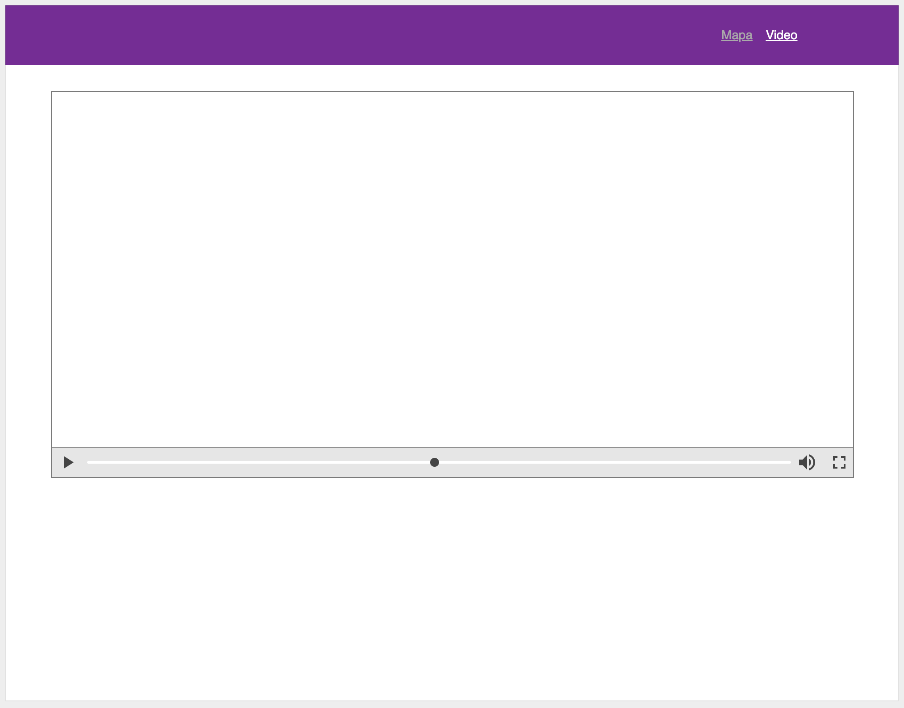

# JSFS-2020-11-HACKATON-1

## Objetivo General

Construir una aplicacion web que permita ver en un mapa, las ubicaciones y fotos de los miembros del curso. Esto incluye mentore@s y alumn@s.

## Objetivos específicos

1. Crear un servidor Web que sirva la aplicación Web con todos los archivos necesarios para que funcione, HTML, CSS, JS, imagenes, etc.
1. Crear un REST API que retorne la lista de usuarios con los siguientes datos:

   - Nombre
   - Usuario de GitHub
   - Ubicación
   - Rol
   - Código

1. Crear un mapa usando [google maps API](https://developers.google.com/maps/documentation/javascript/overview#maps_map_simple-html)
Languaje: https://developers.google.com/maps/documentation/javascript/localization#Region

   - El mapa debe mostrar la ubicación de cada usuario usando la imagen de GitHub
   - Al Hacer click en el marcador del usuario debe mostrar un detalle (toda la información) del usuario seleccionado
   - El mapa en la carga inicial debe contener todos los puntos correspondientes a todos los usuarios retornados por el API

## Retos adicionales

1. Poner el mapa en español
1. Poner el [video](https://www.youtube.com/watch?v=aUu3OYkzXtw) de Youtube de Ada en el tab de Video
1. Hacer un campo que pueda filtrar el mapa por nombre de usuario
   - El REST API debe recibir un nombre y devolver los resultados filtrados segun el criterio de búsqueda
1. Desplegar la aplicación en [Heroku](https://devcenter.heroku.com/articles/deploying-nodejs)

## Wireframes

## Bugs
1. Relative url for endpoint : https://stackoverflow.com/questions/2005079/absolute-vs-relative-urls/2005097#2005097

## Preguntas
1. Para hacer la consulta del nombre desde el navegador, quien tiene 
que verificar el formato del input? y quien que la respuesta no sea vacia?
o que tenga algun otro error?

## Heroku
1. git heroku push main
2. https://tranquil-chamber-22729.herokuapp.com